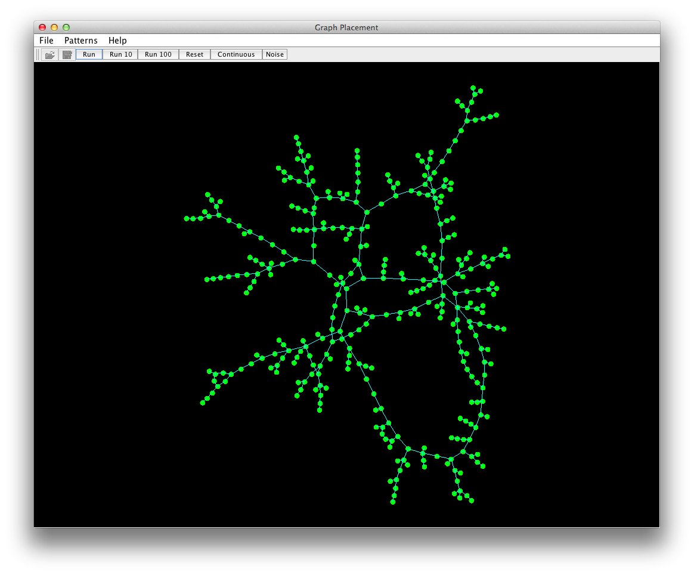

Graph-Placement
===============

Java code to lay out out an arbitrary graph (nodes and links) on the screen.

This a java code takes an arbitrary set of connected nodes and edges and
finds an optimum way to lay them out on a 2-d surface. There are
several automatic ways of generating node data with different structures.
The nodes can be manually moved with the mouse. 

